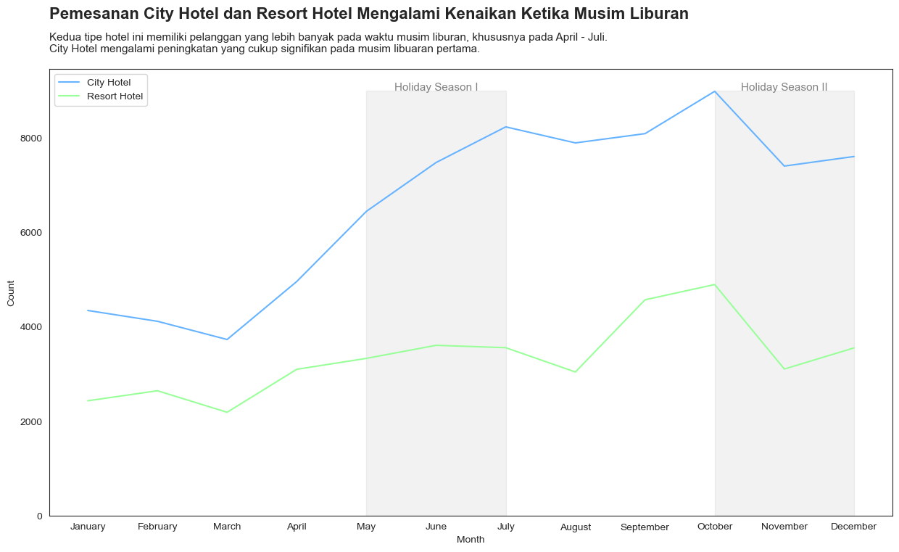
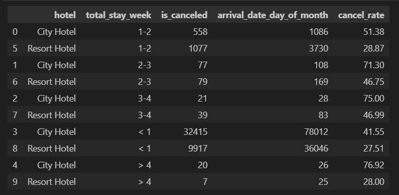

# **Investigate Hotel Business Using Data Visualization**
### Author : Althaaf Athaayaa Daffa Qushayyizidane


## **Background**

> Context: 

#### As a member of the Data Scientist team, I have the responsibility to provide insights related to hotel business performance. These insights can be sought through data exploration, such as analyzing how customers behave in booking hotel tickets or looking for factors that influence the cancellation of hotel ticket bookings.
<br>
<br>

## **Steps**

- Data Preprocessing
- Monthly Hotel Booking Analysis Based on Hotel Type
- Impact Analysis of Stay Duration on Hotel Bookings Cancelation Rate
- Impact Analysis of Lead Time on Hotel Bookings Cancellation Rate
<br>
<br>
<br>

# **Getting Started**

## **Import Library**

```sh
# Melakukan import library
import warnings
warnings.filterwarnings('ignore')

import numpy as np
import pandas as pd
import seaborn as sns
from scipy import stats
import matplotlib.pyplot as plt
from matplotlib import rcParams
%matplotlib inline
```
<br>
<br>
<br>

## Load Data

```sh
hb_raw = pd.read_csv('hotel_bookings_data.csv')
hb_raw.sample(5)
```


<br>
<br>
<br>

## **Exploratory Data Analysis (EDA)**

### Describe Data


#### Melakukan Pengecekan Type Data
#### Dataframe terdiri dari 29 kolom dan 119390 baris.
#### Dataframe memiliki kolom dengan 9 kategorikal, dan 20 numerikal.
<br>
<br>
<br>

### Checking Null Value


#### Dari 29 kolom terdapat **4** kolom yang memiliki missing value yaitu kolom  **children**, **city**, **agent**, dan **company**. Dimana nantinya akan dilakukan imputasi.
<br>
<br>
<br>

### Checking Duplicate Value

```sh
hb_raw.duplicated().sum()


33261
```

#### Terdapat **33.261** data duplikat dan tidak akan dihapus karena data duplikat terlalu banyak yang dikhawatirkan akan mempengaruhi nilai statistik dalam analisis.
<br>
<br>
<br>

### Group Column by Type

```sh
# Pengelompokan kolom berdasarkan jenisnya
num = ['int64', 'int32', 'int16', 'float64', 'float32', 'float16']
num = hb_raw.select_dtypes(include=num)
num = num.columns
cats = ['arrival_date_month','meal','city','market_segment','distribution_channel','deposit_type','customer_type','reservation_status']
```
<br>
<br>
<br>

### Univariate Analysis


- #### Overall, the majority of features have outliers
- #### There are quite extreme outlier gaps in the adr, required_car_parking_spaces, children, and babies features.
- #### Handling outliers will be done removing extreme values only, so as not to reduce the insight generated
<br>
<br>
<br>

#### Checking guest anomaly data = 0 or there is a room booked but no guest staying

```sh
zero_guest = hb_raw['stays_in_weekend_nights'] + hb_raw['stays_in_weekdays_nights'] + hb_raw['adults'] + hb_raw['children'] + hb_raw['babies']
zero_guest = hb_raw[zero_guest == 0]
zero_guest.shape[0]


70
```
#### There are **70 rooms with no guests** and this data will be **dropped**.
<br>
<br>
<br>

## **Data Preprocessing**

### Data Cleansing

```sh
hb_clean =  hb_raw.copy()
```
<br>

#### Categorical Column Imputation

```sh
hb_clean['city'].fillna('Undefined', inplace=True)
```
<br>

#### Numerical Column Imputation

```sh
imp = ['company', 'children', 'agent']
for col in imp:
    hb_clean[col].fillna(0, inplace=True)
```

```sh
hb_clean.isna().sum()


hotel                             0
is_canceled                       0
lead_time                         0
arrival_date_year                 0
arrival_date_month                0
arrival_date_week_number          0
arrival_date_day_of_month         0
stays_in_weekend_nights           0
stays_in_weekdays_nights          0
adults                            0
children                          0
babies                            0
meal                              0
city                              0
market_segment                    0
distribution_channel              0
is_repeated_guest                 0
previous_cancellations            0
previous_bookings_not_canceled    0
booking_changes                   0
deposit_type                      0
agent                             0
company                           0
days_in_waiting_list              0
customer_type                     0
adr                               0
required_car_parking_spaces       0
total_of_special_requests         0
reservation_status                0
dtype: int64
```
<br>
<br>
<br>

### Handling Inconsistent and Extream Values

#### Change the **meal** feature to only 2 categories, namely **With Meal** and **No Meal**.

```sh
hb_clean['meal'].replace('Undefined', 'No Meal', inplace = True)
hb_clean['meal'].replace(['Breakfast', 'Full Board', 'Dinner'], 'With Meal', inplace = True)
```
<br>

#### The **children** feature should use an integer datatype.

```sh
hb_clean['children'] = hb_clean['children'].astype('int64')
```
<br>

#### Removing extreme values in the data

```sh
# adr adr
index_adr = hb_clean[(hb_clean['adr'] < 0) | (hb_clean['adr'] > 5000)]
hb_clean.drop(index = index_adr.index, inplace=True)

# --------------------------------------------------------------------------------
# required_car_parking_spaces
index_parking = hb_clean[(hb_clean['required_car_parking_spaces'] == 8)]
hb_clean.drop(index = index_parking.index, inplace=True)

# --------------------------------------------------------------------------------
# babies
index_bb = hb_clean[(hb_clean['babies'] > 8)]
hb_clean.drop(index = index_bb.index, inplace=True)

# --------------------------------------------------------------------------------
# children
index_ch = hb_clean[(hb_clean['children'] == 10)]
hb_clean.drop(index = index_ch.index, inplace=True)

# --------------------------------------------------------------------------------
# tidak ada tamu
index_zero_guest = hb_raw['stays_in_weekend_nights'] + hb_raw['stays_in_weekdays_nights'] + hb_raw['adults'] + hb_raw['children'] + hb_raw['babies']
index_zero_guest = hb_clean[index_zero_guest == 0]
hb_clean.drop(index = index_zero_guest.index, inplace=True)

```


<br>
<br>
<br>

## **Monthly Hotel Booking Analysis BAsed on Hotel Type**

```sh
hb_fromclean = hb_clean.copy()
```
<br>

### Ratio Total Booking

```sh
hotel_type = hb_fromclean.groupby('hotel')[['hotel']].count()
#-------------------------------------------------------------------
hotel_type.columns = ['total']
hotel_type.reset_index(inplace=True)
hotel_type
```


- #### From this plot, you can see that there are two types of hotels chosen by customers: City Hotel dan Resort Hotel. City Hotels are hotels located in major cities, while Resort Hotels are hotels located in natural tourist areas. 

- #### From this plot, you can also see that **City Hotel** dominates the bookings with **a proportion of 66%**, while **Resort Hotel** only has **a proportion of 34%**. This means that more customers choose to stay at hotels located in city centers than hotels located in natural tourist areas.
<br>

**CONCLUSIONS**

- #### Customer preferences**: Customers prefer hotels located in major cities, perhaps for reasons of ease of access, facilities, or price.

- #### **Market potential** : Resort Hotels have greater market potential, as **there are still many customers who have not tried** hotels located in nature tourism areas. Resort Hotels can improve their marketing to attract more customers.

- #### Business strategy** : City Hotel and Resort Hotel can develop different business strategies according to their customer characteristics and needs. **City Hotels can focus on service quality, safety, and comfort**, while **Resort Hotels can focus on experience, beauty, and uniqueness**.
<br>
<br>
<br>

### Ratio Total Booking per Month

```sh
mh_booking = hb_fromclean.groupby(['hotel', 'arrival_date_month'])['arrival_date_year'].agg(['nunique', 'count']).reset_index()
mh_booking
```


#### In the summer months, hotels and resort hotels have high booking rates. This can be attributed to the high demand from vacationing tourists.




- #### **Seasonal trends**: Resort hotels have a higher number of bookings during the holiday season, which is in July, August and December. This may be because resort hotels are located in natural tourist areas which are more desirable for customers during vacation. Meanwhile, city hotels have a more consistent number of bookings throughout the year. This may be because city hotels are located in major cities that have stable demand from business or non-holiday customers.

- #### **Hotel comparison**: City hotels always have a higher number of bookings than resort hotels in every month. This may be because city hotels have larger capacity, lower prices, or more effective marketing than resort hotels.
<br>
<br>
<br>

## **Impact Analysis of Stay Duration on Hotel Bookings Cancellation Rates**

### Total Cancelation Rate


- #### 42% of the total city hotel bookings were canceled, while 58% were not canceled. This means that more than half of the city hotel bookings were successfully made.

- #### **Impact of cancellation on business**, there are several possible impacts that can be considered are: decreased revenue, increased operating costs, decreased customer loyalty, decreased reputation, and increased competition.
<br>
<br>


- #### 28% of the total hotel resort bookings were canceled, while 72% were not canceled. This means that more than two-thirds of the resort hotel bookings were successfully made.

- #### **Comparison with city hotels**, From the comparison, it can be seen that resort hotels have a lower cancellation ratio than city hotels. This may indicate that customers are more committed to staying at resort hotels than city hotels.

- #### **Impact of cancellation on business**, there are several possible impacts that can be considered are: decreased revenue, increased operating costs, decreased customer loyalty, decreased reputation, and increased competition.
<br>
<br>

### Cancelation Rate by Stay Duration




- #### The cancellation rate of hotel bookings increases with the duration of stay**. This is true for both types of hotels, namely city hotels and resort hotels. This could indicate that customers who book for longer stays are more at risk of canceling their booking for various reasons.

- #### **City hotels have a higher cancellation rate than resort hotels** for each category of stay duration. This could indicate that city hotels are more prone to cancellations than resort hotels, as city hotels may be easier to replace with other hotels that are cheaper or closer to the customer's destination.

- #### The least canceled duration of stay is less than 1 week** for both types of hotels. This may indicate that customers who booked for a stay of less than 1 week are more certain to stay at their chosen hotel. Therefore, hotels can offer **discounts** or **incentives** for customers who book to stay less than 1 week to attract more customers and reduce cancellations.
<br>
<br>
<br>

## **Impact Analysis of Lead Time on Hotel Bookings Cancellation Rate**

### Duration of Lead time


- #### Most hotel bookings have a short lead time**, which is less than 100 days. This means that customers tend to book hotels close to their arrival date. The plot also shows that **only a few hotel bookings have a long lead time**, which is more than 300 days. This means that customers rarely book hotels well in advance of their arrival date.

- #### The effect of lead time on the cancellation rate**, from several other sources, it can be found that **lead time has a positive effect on the cancellation rate**. This means that the longer the lead time, the more likely a hotel booking is to be canceled. This can be caused by various factors, such as **changes in plans, uncertainty, better deals, or flexible cancellation policies**.

- #### Some strategies that can be considered are: offering lower prices for bookings with short lead times, providing incentives for bookings with long lead times, adjusting cancellation policies according to lead times, increasing customer loyalty, and following market demand trends.
<br>
<br>

### Cancellation Rate by Lead Time


- #### City Hotel has a higher cancellation rate compared to Resort Hotel for all booking time periods.

- #### The highest cancellation rate for City Hotel occurs at 12 months booking time, while for Resort Hotel, the highest cancellation rate is at 11 months.

- #### The hotel booking cancellation rate tends to increase with the booking time**. This means that the further away the booking time is from the arrival date, the more likely the booking is to be canceled by the customer.
